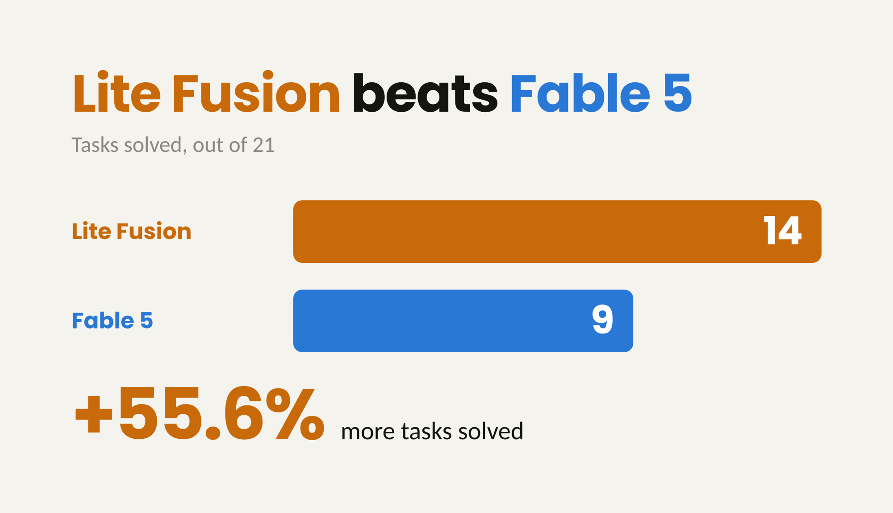

**LiteLLM Auto Router Fusion solved 14 of 21 Terminal-Bench tasks; Claude Fable-5 on its own solved 9.** Fusion runs the task on several models in parallel and has one of them synthesize the candidate work into a single answer. Both arms ran the same 21 tasks.

{/* truncate */}

:::info[🚀 Help shape the Auto-Router]

Get early access, work directly with the LiteLLM team, and influence the roadmap with your production traffic.

<a className="button button--primary button--lg" style={{background: '#2e8555', borderColor: '#2e8555', color: '#fff'}} href="https://calendar.app.google/i2e7qVEJphHi5S8UA">Apply to Become a Design Partner</a>

  

Already testing it? Share your results in [discussion #32168](https://github.com/BerriAI/litellm/discussions/32168).

:::

## Key findings

- **Fusion solved 5 more tasks**, 14/21 against 9/21, a 24 point jump in solve rate on this subset
- **Total spend rose 36%** ($67.13 to $91.64) while **cost per solved task fell 12%** ($7.46 to $6.55)
- **The extra models are cheap; the synthesis is not.** Opus-5 and Kimi-K3 together account for $21.27 of the fusion bill. The Fable-5 component alone is $70.37, more than the entire single model arm
- **Latency is the real cost.** Median turn went from 6s to 30s and p95 from 55s to 237s, with median wall clock per task moving from 5 to 8 minutes
- **Fusion is not strictly better.** It lost one task the single model solved, and it lost it to a timeout rather than a wrong answer

## Results

| Arm | Solve rate | Solved/n | Total cost | $/solved | Median turn | p95 turn | Median task wall clock | Agent turns |
|---|---:|---:|---:|---:|---:|---:|---:|---:|
| Fusion: Fable-5 + Opus-5 + Kimi-K3 | **66.7%** | **14/21** | $91.64 | **$6.55** | 30s | 237s | 8 min | 169 |
| Fable-5 only | 42.9% | 9/21 | $67.13 | $7.46 | 6s | 55s | 5 min | 395 |

Fusion needed 57% fewer agent turns to get further, because a synthesized answer arrives closer to correct and the agent spends less time iterating. Each of those turns costs roughly 5x more wall clock, so the task still takes longer end to end.

## Where the extra tasks came from

Eight tasks were solved by both arms. Fusion added six that the single model missed: `chess-best-move`, `crack-7z-hash`, `largest-eigenval`, `llm-inference-batching-scheduler`, `password-recovery`, and `write-compressor`. Six were solved by neither. The one regression, `winning-avg-corewars`, timed out under fusion.

| Task | Fable-5 | Fusion |
|---|---|---|
| adaptive-rejection-sampler | failed | failed (timeout) |
| build-pmars | solved | solved |
| chess-best-move | failed (timeout) | **solved** |
| cobol-modernization | solved | solved |
| crack-7z-hash | failed | **solved** |
| filter-js-from-html | failed | failed |
| gcode-to-text | failed (timeout) | failed (timeout) |
| install-windows-3.11 | failed | failed |
| largest-eigenval | failed | **solved** |
| llm-inference-batching-scheduler | failed (timeout) | **solved** |
| merge-diff-arc-agi-task | solved | solved |
| multi-source-data-merger | solved | solved |
| overfull-hbox | solved | solved |
| password-recovery | failed | **solved** |
| polyglot-c-py | failed | failed |
| prove-plus-comm | solved | solved |
| pypi-server | solved | solved |
| sparql-university | solved | solved |
| train-fasttext | failed | failed (timeout) |
| winning-avg-corewars | **solved** | failed (timeout) |
| write-compressor | failed | **solved** |

The six tasks fusion picked up are the ones where a second opinion changes the answer: cracking a hash, finding an eigenvalue, writing a compressor. Different models attack these differently, and the synthesis step gets to pick the line of attack that worked instead of committing to one up front.

## Where the money goes

| Model | Spend in fusion arm | Share |
|---|---:|---:|
| claude-fable-5 | $70.37 | 76.8% |
| claude-opus-5 | $17.37 | 19.0% |
| kimi-k3 | $3.90 | 4.3% |

Adding Opus-5 and Kimi-K3 as candidate generators cost $21.27 across all 21 tasks. The Fable-5 line item grew past the entire single model baseline because Fable both generates a candidate and synthesizes on 167 of 169 turns. If you want to bring the fusion bill down, the lever is the synthesizer, not the size of the candidate pool.

## How it was measured

- **Benchmark:** the same 21 task subset of Terminal-Bench 2.0 used in our [earlier auto router benchmark](/blog/auto-router-terminal-bench-benchmark)
- **Baseline arm:** every request to `claude-fable-5` at high effort
- **Fusion arm:** `claude-fable-5`, `claude-opus-5`, and `kimi-k3` each produce candidate work at high effort; `claude-fable-5` synthesizes the final answer. Synthesis ran on 167 of 169 turns
- **Cost:** total USD across all 21 tasks from gateway spend logs, including every candidate call and the synthesis call
- **Failures:** agent timeouts count as failures. The fusion arm hit 5 timeout rows against 3 for the baseline, which is consistent with its higher per turn latency
- **Provider errors:** failed rows per model group were 7 for Fable-5, 6 for Opus-5, and 4 for Kimi-K3, plus 2 arm level failures on each side. The fusion arm also logged 21 `content_filter` rows, all on candidate generations

One run per arm on 21 tasks is a directional result, not a confidence interval. It says fusion is worth measuring on your own workload; it does not establish a solve rate for Terminal-Bench overall, and these numbers should not be read against the arms in the earlier post, which used a different configuration.

## When to reach for it

Fusion buys completed tasks with latency and total spend. That trade works when finishing the task is what you are paying for, which covers migrations, hard debugging, offline agent runs, and evaluation harnesses. It does not work behind an interactive request where a 237s p95 turn is visible to a user. If you are already running a frontier model at high effort and still watching tasks fail, the question worth asking is whether a second and third candidate would have solved them, and this subset says that about a quarter of the time it would.

## Try it

:::info

Point an agent at several models on the same task, synthesize the results, and compare completed tasks per dollar against your current single model. Share numbers or questions in [discussion #32168](https://github.com/BerriAI/litellm/discussions/32168). To work on this with us directly, [apply to be a design partner](https://calendar.app.google/i2e7qVEJphHi5S8UA).

:::

Related reading: [stacking auto-routing on prompt caching](/blog/auto-router-prompt-caching-benchmark) and [what auto-routing saved in production](/blog/auto-router-production-savings).
